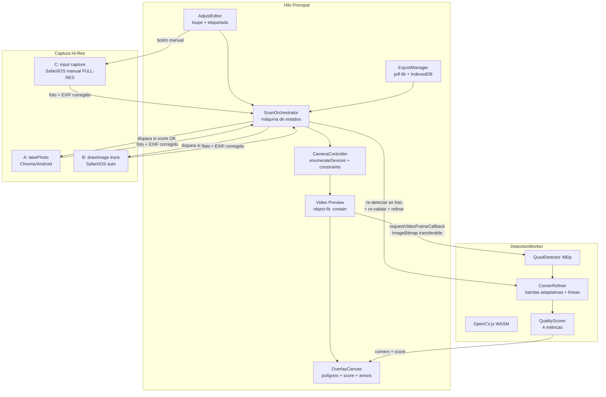
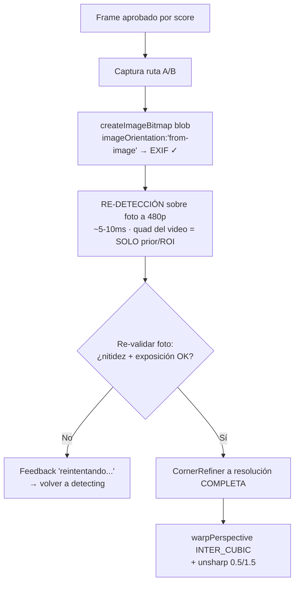
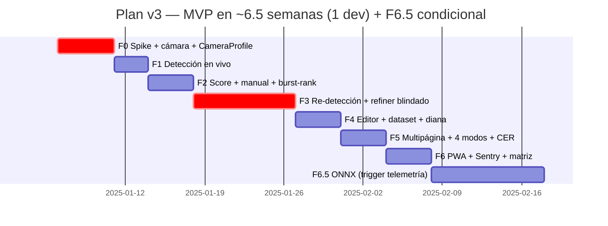

# 📋 PLAN MAESTRO v3.0 (Consolidado)
## Digitalizador de Documentos en Navegador — Cliente-Side

> Documento único de referencia. Incorpora las 5 rondas de revisión: documento teórico → plan v1 → triaje de 3 análisis → v2 → análisis final. **Congelado para ejecución.**

---

## 1. Objetivo y Alcance

**Objetivo principal:** Digitalizador móvil 100% web con **máxima precisión en captura y recorte automático** y **alta calidad de documento final**, ejecutándose en el navegador (sin app nativa).

**Éxito medible:**
- Corner error **±X mm al 95%** (medido con diana física, no abstracto)
- IoU ≥ 0.95 por condición, medido en set congelado propio
- < 15% de capturas requieren ajuste manual (verificado vía telemetría)
- DPI efectivo **medido en runtime** por captura, no prometido por plataforma

### 🔒 No-Goals explícitos del MVP (decisiones documentadas, no accidentes)

| Fuera de scope MVP | Motivo | Cuándo se reconsidera |
|---|---|---|
| **Dewarping 3D** (DewarpNet/DocTr/UVDoc) | Requiere modelos pesados; homografía plana cubre documentos planos | Post-MVP si hay demanda de libros/recibos arrugados |
| **OCR en producción client-side** | Tesseract.js es lento y mediocre; el OCR serio vive en servidor | Fase servidor (proyecto separado) |
| **Compresión MRC/JBIG2** | Complejo; pdf-lib + encoding por modo es suficiente para MVP | Post-MVP |
| **Warp en WebGL** | Optimización; con cap de 3500px el warp CPU es aceptable | Si el perfilado muestra >1s |

---

## 2. Decisiones de Stack

| Decisión | Elección | Razón clave |
|----------|----------|-------------|
| Build | Vite + TypeScript | HMR; TS evita bugs de coordenadas (crítico en geometría) |
| Visión | OpenCV.js (WASM) en Web Worker | Control fino del protocolo de mensajes; jscanify como referencia |
| Modelo DL (F6.5) | YOLOv8n-pose 4 keypoints → ONNX | Mismo contrato "4 esquinas" que el detector clásico |
| Framework UI | Vanilla TS (o web component si hay app React existente) | El core es canvas+worker; framework añade complejidad sin beneficio |
| PDF | pdf-lib | Incrusta JPEG/PNG sin recomprimir |
| Storage | IndexedDB (idb-keyval) + `storage.persist()` | localStorage insuficiente; iOS purga sin persist |
| PWA | Sí (Workbox) | Cachea opencv.js (8MB) → 2º arranque <2s |
| **NO requerido** | COOP/COEP | WebGPU no exige `crossOriginIsolated`; solo beneficiaría al fallback WASM multithread (post-MVP) |

---

## 3. Arquitectura



**Protocolo Worker:** `{type:'detect', bitmap} transferable` → `{type:'result', corners, score}`. Backpressure: frames descartados si el worker está ocupado. **Disciplina de memoria:** todo `cv.Mat` en wrapper `withMats()` con `.delete()` en `finally`.

---

## 4. Números Honestos de Calidad por Plataforma

> ⚠️ **Verificado en revisión final:** la cifra "~220 DPI iOS" era incorrecta. La tabla correcta — el spike de F0 confirma cuál aplica a tu base de usuarios:

| Ruta | Resolución | DPI efectivo (A4 llenando encuadre) | Nota |
|---|---|---|---|
| Android `takePhoto()` 12MP | 3000×4000 | **~360 DPI** | Ruta de calidad en Android |
| iOS track 1080p | 1080 ancho | **~130-165 DPI** | Lectura/OCR ok; NO impresión |
| iOS track 4K (si `getSettings()` lo confirma) | 2160 ancho | ~260-330 DPI | El spike lo determina por modelo |
| iOS manual (`input capture`) | Full sensor | **~300+ DPI** | **Es la ruta de calidad en iOS** — UX de primera clase, no escape |

**Consecuencia de diseño:** el `CameraProfile` calcula y loguea DPI en runtime (`anchoQuadPx / 8.27`). El copy de producto no promete calidad uniforme entre plataformas.

---

## 5. Fases

### 📍 F0 — Fundaciones + SPIKE (5 días)

**Spike (días 1-2, en 2-3 dispositivos REALES — BrowserStack no sirve para getUserMedia; incluye iPhone físico):**

- [ ] `getSettings()` → ¿track 4K disponible en iOS moderno? (define la tabla de DPI real)
- [ ] `takePhoto()`: resolución, latencia, fallos por dispositivo
- [ ] iOS: ¿`<input capture>` permite 1 foto por gesto o varias? (define flujo multipágina)
- [ ] `createImageBitmap(blob, {imageOrientation:'from-image'})` en Safari
- [ ] Capabilities: `torch`, `focusMode`, **teleobjetivo/lente principal** (¿`enumerateDevices()` las lista?)

**Construcción (días 3-5):**

| Tarea | Detalle |
|---|---|
| `CameraController` | `enumerateDevices()` → elegir **cámara principal trasera explícita** (no confiar en `facingMode`, puede agarrar la tele/ultra-wide) |
| `<video>` | `playsinline muted` (obligatorio iOS) |
| `CameraProfile` | Resolución track, aspect ratio, capabilities, **DPI runtime**, settings reales verificados |
| Torch | `applyConstraints({advanced:[{torch:true}]})` si existe; degradación silenciosa en iOS (CLAHE posterior mitiga) |
| Bucle | `requestVideoFrameCallback` con fallback rAF |

**✅ DoD:** Preview en móvil real; log del CameraProfile con datos del spike; linterna en Android; capacidades documentadas por dispositivo.

---

### F1 — Detección en Vivo (3 días)

| Tarea | Detalle |
|---|---|
| Lazy-load opencv.js | Con progreso; cacheado por service worker; evaluar build custom (~2-3MB solo `imgproc`) |
| `QuadDetector` | Canny + contornos + `approxPolyDP` sobre frame a 480p |
| Validación estricta | Convexidad + área >25% + **proporciones razonables** (rechazar 20:1) + **aristas mínimas** → evita disparos sobre folletos/pantallas |
| Backpressure | Frames descartados si worker ocupado |
| Overlay | **`object-fit: contain`** en el video (con cover el polígono queda desplazado); verde/rojo según validez |
| Memoria | `withMats()` + test de estrés 10 min |

**✅ DoD:** Polígono abraza el papel en tiempo real en Chrome Android + Safari iOS, UI fluida, sin leaks.

---

### F2 — Score de Calidad + Shutter (4 días)

**`QualityScorer` — se mide sobre el CROP del documento a resolución fija (nunca sobre frame completo; umbrales calibrados con capturas reales):**

```typescript
score = 0.4·S_nitidez        // Var(Laplacian) sobre crop 480p
      + 0.3·S_exposición     // percentiles 5/95 del histograma del crop
      + 0.3·S_estabilidad    // varianza de quads en ventana TEMPORAL (300ms medidos en ms,
                             //   no "5 frames": el backpressure descarta frames)
// + Penalización de excentricidad del quad (esquinas pegadas a bordes del frame
//   = territorio de distorsión de lente → avisar "centra el documento")
// + Brillo especular: si >2-3% de píxeles >248 en el crop →
//   "Evita el reflejo, muévete un poco" (info IRRECUPERABLE por CLAHE)
```

**Disparo — con burst-rank como DEFAULT (no fallback):**
```
score > 0.8 sostenido 300ms
  → capturar 2-3 frames del stream alrededor del disparo (~30ms c/u)
  → + 1 takePhoto (Android) / drawImage (iOS)
  → RE-VALIDAR todos (nitidez+exposición sobre crop)
  → gana takePhoto si pasa; si no, mejor frame del burst
```

**Escapes obligatorios (cierran la dependencia circular detección→score→shutter):**
- **Botón de shutter manual SIEMPRE visible**
- Timeout: >8s sin detección → "Activa la captura manual o mejora la iluminación"

**Feedback:** `navigator.vibrate(50)` en Android; **flash visual del overlay en iOS** (vibrate no existe ahí).

**✅ DoD:** Estable → captura sola <2s; borroso → no dispara; sin detección → manual siempre disponible.

---

### 🔴 F3 — Captura Hi-Res + Recorte Preciso (9 días, CRÍTICA)

**El diseño corregido** (el escalado `fotoWidth/videoWidth` era incorrecto: el video es un crop 16:9 del sensor, la foto es 4:3 completa):



**Spec del `CornerRefiner` (corazón del producto, con sus 3 blindajes):**

1. **Banda adaptativa:** `max(30px, 1.5% de la longitud del lado)` — el error de detección 480p escalado 6-8× es 12-25px; banda fija de 30px no cubría
2. **Excluir 10-15% extremo de cada lado del ajuste de línea** — esquinas redondeadas/bordes curvos sesgan la regresión; la intersección de líneas *extendidas* recupera la esquina ideal. Ajuste robusto con rechazo de outliers (RANSAC)
3. **Validación post-refine:** convexidad + no-auto-intersección + área → si un lado falla, **fallback a la esquina de 480p solo para ese lado** + marcar para el editor

**Presupuesto de memoria (crítico en móviles de 3GB):**
- **Cap del lado largo de salida: ~3500px** (A4 a 300 DPI reales; más es desperdicio)
- Estimación del fondo de sombras (dilatación+mediana) sobre versión **reducida**, nunca sobre 12MP
- Picos objetivo: <150MB

**✅ DoD:** El recorte no corta texto ni incluye fondo; esquinas refinadas visiblemente mejores que las sin refinar; funciona en los 2-3 dispositivos del spike.

---

### F4 — Editor + Recolección de Datos (4 días)

| Tarea | Detalle |
|---|---|
| 4 esquinas arrastrables | Touch targets ≥44px + **loupe 3×** (sin ella el ajuste fino en móvil es imposible) |
| Revertir a auto / confirmar | Re-warp al confirmar |
| **Modo etiquetado (opt-in)** | Loguea el quad automático de **TODAS** las capturas (+ el ajustado si existe). ⚠️ Etiquetar solo correcciones = dataset de solo fallos (**sesgo de selección**); revisión humana periódica de una muestra de las correctas |
| **Set de test congelado** | 50-100 imágenes estratificadas por condición que **jamás** tocan entrenamiento (evita fuga de evaluación) |
| **Diana de calibración** | A4 impreso con esquinas a distancias conocidas (mm) → script en `tests/bench/` → reportar "error ±X mm al 95%" |

**✅ DoD:** Corregir una esquina en <2s; colector de dataset corriendo con datos balanceados.

---

### F5 — Multipágina + Modos + Exportación (4 días)

**Los 4 modos de procesamiento** (el 4º es decisión de producto: el magic color agresivo destroza fotos, firmas y sellos):

| Modo | Pipeline | Encoding |
|---|---|---|
| **Color** | Sombras (división morfológica sobre versión reducida) + CLAHE canal L (LAB) | JPEG q88-92 |
| **Gris** | Sombras + CLAHE luminancia | JPEG q88-92 |
| **B/N** | Sauvola con **ventana parametrizada por DPI** (~2% del lado menor ≈ 50-70px @300DPI, no píxeles fijos) | **PNG** (sin ringing de JPEG en glifos) |
| **Natural** | Solo sombras + punto blanco, **sin CLAHE** | JPEG q90 |

**Resto:**
- Cola multipágina (miniaturas, reorder, delete) → IndexedDB con **`storage.persist()` + `estimate()`** (iOS purga IndexedDB de PWAs poco usadas → aviso si cuota apretada o páginas sin exportar)
- PDF multipágina (pdf-lib), fit A4/Letter
- **Harness de calidad CER** (la mejor relación costo/beneficio restante, 1-2 días): Tesseract.js/PaddleOCR sobre ~30 documentos fijos propios, antes/después del enhance, por modo y categoría → si CLAHE agresivo sube el CER en papel satinado, lo sabes con número
- `navigator.share()` para exportar

**✅ DoD:** 3 páginas → reorder → PDF <3MB → compartir. El harness reporta qué modo gana por tipo de documento.

---

### F6 — PWA + Endurecimiento (4 días)

| Tarea | Detalle |
|---|---|
| PWA | manifest + Workbox (app shell + opencv.js cacheados) |
| **Telemetría (Sentry)** | Sin crash reporting ninguna métrica de aceptación es verificable en producción |
| Errores | Permisos denegados, sin getUserMedia, cámara ocupada, rotación, background |
| **Matriz de dispositivos** | Documentada desde F0 + checklist de regresión semanal (rotación, background, permisos revocados) |

**✅ DoD:** Instalable; 2º arranque <2s; sobrevive rotación/background en la matriz documentada.

---

### F6.5 — Modelo ONNX (condicional, 10 días)

**Trigger escrito en el plan:** si la telemetría post-MVP muestra **>15% de ajustes manuales en fondos complejos** → se activa. La precisión deja de depender de la fe en el clásico.

| Tarea | Detalle |
|---|---|
| **Datos (el critical path son los datos, no el modelo)** | Fine-tune YOLOv8n-pose (4 kp) sobre dataset PROPIO: 300-500 imágenes + augmentations (100-200 es marginal). Hard-example mining de los logs de timeout de 8s |
| ⚠️ Licencia | **MIDV-500 = CC BY-NC-SA (NO comercial).** Solo sanity-check en investigación; NUNCA entrenamiento para producto comercial. El mismatch de dominio (IDs vs A4/recibos) ya lo hacía poco útil |
| Export | ONNX → cuantización INT8 (~4-6MB) |
| Runtime | `onnxruntime-web`, `executionProviders:['webgpu','wasm']` (fallback automático) |
| Integración | Mismo contrato "4 esquinas"; híbrido: clásico primero, DL si score bajo |

**✅ DoD:** Fondo blanco-sobre-blanco y sombra de mano detectados; IoU por condición en el set congelado ≥0.95.

---

## 6. Límite Físico Documentado: Distorsión de Lente

**Aceptado por diseño (no es un bug que perseguir):** las lentes gran angular tienen distorsión radial de barril → bordes levemente curvos → Hough (rectas) introduce error sistemático peor en esquinas → **una homografía de 4 puntos no lo corrige**.

Mitigaciones ya integradas: preferir teleobjetivo · penalizar excentricidad · **techo aceptado: 1-2px CDE en esquinas extremas**. Cuando llegues a ese techo, es la física de la lente — no pierdas semanas en el código.

---

## 7. Métricas de Aceptación v3

| Métrica | Umbral | Cómo se mide |
|---|---|---|
| Corner error | **±X mm al 95%** | Diana física (F4) |
| IoU | ≥0.93 clásico / ≥0.95 con F6.5, **por condición** | Set congelado propio (baja luz, sombra, fondo blanco, inclinación) |
| DPI efectivo | Medido y logueado por captura | Runtime en CameraProfile |
| Auto-captura desde estable | <2s | Manual en spike |
| Ajuste manual | <15% | Telemetría opt-in (F6) |
| FPS detección / latencia overlay | ≥15 / <100ms | Perf marks en Android medio |
| Calidad enhance | CER no aumenta vs sin enhance | Harness (F5) |
| Memoria | 0 leaks tras 10 min continuos; picos <150MB | Test de estrés |
| PDF 5 páginas | <8MB | Export test |

---

## 8. Estructura del Proyecto

```
mobile-scanner/
├── src/
│   ├── core/                    # Sin DOM → testeable en Node (corre el mismo código que producción)
│   │   ├── types.ts             # Corner, Quadrilateral, QualityScore, CameraProfile, ScanPage
│   │   ├── geometry.ts          # orderPoints, intersección de líneas, reordenación
│   │   └── quality.ts           # Score compuesto (compartido worker/benchmark)
│   ├── workers/detection.worker.ts
│   ├── camera/
│   │   ├── CameraController.ts  # enumerateDevices, constraints, torch
│   │   ├── frameLoop.ts         # rVFC + backpressure
│   │   └── hiResCapture.ts      # Rutas A/B/C + EXIF + re-validación
│   ├── scan/
│   │   ├── ScanOrchestrator.ts  # FSM: idle→detecting→capturing→revalidating→editing
│   │   ├── cornerRefiner.ts     # Bandas adaptativas + RANSAC + validación
│   │   └── enhance.ts           # 4 modos
│   ├── ui/ (ScannerView, AdjustEditor+loupe, PageGallery, components)
│   ├── export/ (pdfExport, storage+persist)
│   └── main.ts
├── tests/
│   ├── geometry.test.ts         # ⚠️ incluye test de aspect ratios distintos DESDE DÍA 1
│   ├── quality.test.ts
│   └── bench/                   # MIDV subset (sanity) + diana calibración + harness CER
└── vite.config.ts
```

---

## 9. Riesgos (actualizados)

| Riesgo | Prob | Mitigación |
|---|---|---|
| iOS auto = 1080p (~130-165 DPI) | Alta | Ruta manual es la de calidad, UX primera clase; spike verifica 4K por modelo |
| Techo distorsión de lente | Media | Documentado; tele + excentricidad; 1-2px aceptado |
| Leaks WASM | Media | `withMats()` + estrés 10min |
| opencv.js 8MB | Alta | Lazy + SW + build custom 2-3MB |
| Blanco-sobre-blanco | Alta | Manual inmediato + F6.5 trigger |
| takePhoto re-corre AF/AE (foto peor que frame aprobado) | Media | Re-validación de foto (F3) |
| iOS purga IndexedDB | Media | `persist()` + avisar exportar |
| Autofoco fallido en takePhoto | Baja | Burst-rank ya es default |

---

## 10. Cronograma Final



**Compensación de estimado:** F1 probablemente tomará menos (el worker base existe); F3 lleva 9 días porque concentra los edge cases reales (sombra del dedo sobre borde, esquinas dobladas, bordes curvos).

---

## ✅ Estado: PLAN CONGELADO — Ejecutar

El orden de arranque confirmado por todas las revisiones: **spike de F0 primero** — sin el `CameraProfile` real y las 3 rutas de captura verificadas en dispositivos físicos, todo lo demás es suposición. `geometry.ts` con tests en paralelo (barato, blinda el bug de aspect ratios desde el día 1).